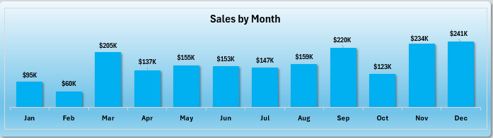

# Sales-Dashboard-Excel
Interactive Sales Dashboard built using Microsoft Excel.
# 📊 Sales & Profit Dashboard (Microsoft Excel)

An interactive Sales & Profit Dashboard built in Microsoft Excel using Pivot Tables, Pivot Charts, Slicers, and Data Visualization techniques.

---

# 📸 Dashboard Preview

## Dashboard Overview

---

## Sales by Month

---

## Profit by Year

---

## Sales by Category

---

## Customer Count by Year

---

## Sales by State

---

# 🚀 Features

- Interactive Dashboard
- Dynamic Pivot Tables
- Pivot Charts
- Monthly Sales Analysis
- Yearly Profit Analysis
- Sales by Category
- Customer Count Analysis
- State-wise Sales Analysis
- Slicers & Filters
- KPI Cards

---

# 🛠 Tools Used

- Microsoft Excel 365
- Pivot Tables
- Pivot Charts
- Slicers
- Conditional Formatting
- Data Cleaning
- Dashboard Design

---

# 📂 Files

- Sales Dashboard.xlsx
- Dashboard Screenshots

---

⭐ If you like this project, don't forget to star this repository.
