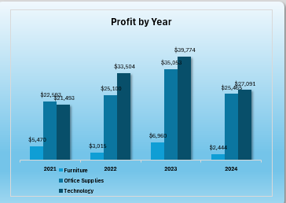
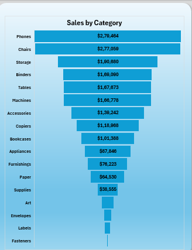
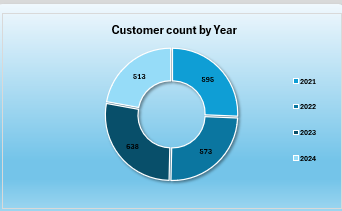
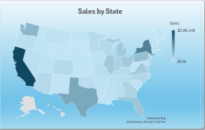

# 📊 Sales Dashboard (Microsoft Excel)

An interactive Sales Dashboard built using Microsoft Excel to analyze sales performance, profit trends, customer growth, and regional sales insights.

---

## 📌 Project Overview

This dashboard provides a complete overview of sales data using interactive charts, pivot tables, and slicers. It enables users to analyze sales performance across different categories, states, and years.

---

## 🚀 Features

- 📈 Monthly Sales Analysis
- 💰 Profit Analysis by Year
- 📦 Sales by Category
- 👥 Customer Count by Year
- 🗺️ Sales by State
- 🎛️ Interactive Slicers
- 📊 Pivot Tables & Pivot Charts
- 📉 Dynamic Dashboard

---

## 🛠 Tools Used

- Microsoft Excel
- Pivot Tables
- Pivot Charts
- Slicers
- Conditional Formatting
- Data Cleaning
- Data Visualization

---

# 📸 Dashboard Preview

## Sales by Month

## Profit by Year

## Sales by Category

## Customer Count by Year

## Sales by State

## 📂 Files Included

- Sales Dashboard.xlsx
- README.md
- Dashboard Images

---

## 💡 Skills Demonstrated

- Data Cleaning
- Data Analysis
- Dashboard Design
- Business Intelligence
- Excel Reporting
- Data Visualization

---

## ⭐ Author

**Kartik Borikar**
